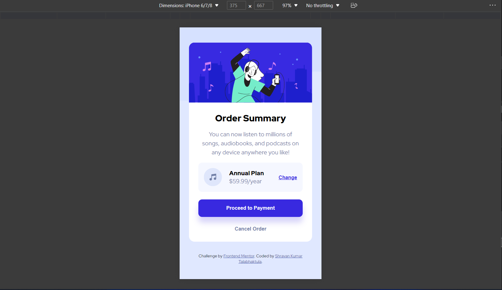
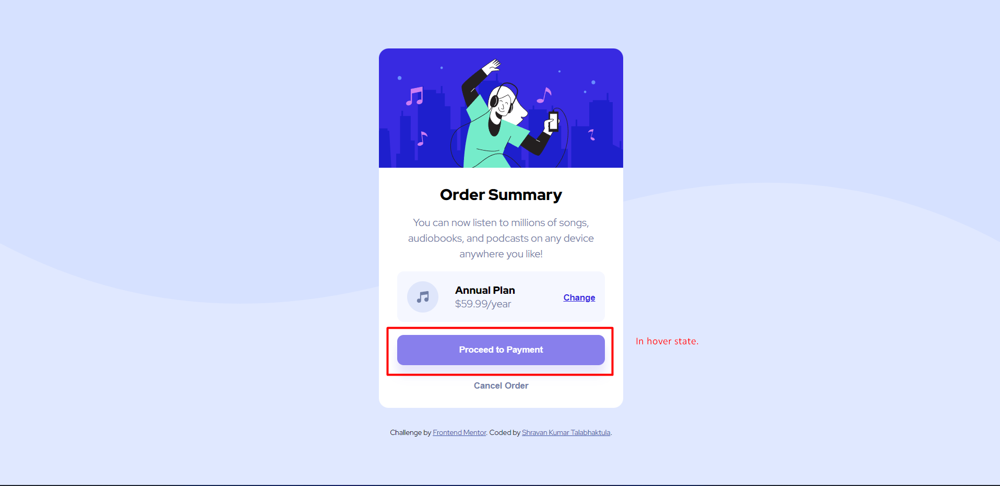

# Frontend Mentor - Order summary card solution

This is a solution to the [Order summary card challenge on Frontend Mentor](https://www.frontendmentor.io/challenges/order-summary-component-QlPmajDUj).

## Table of contents

- [Overview](#overview)
  - [The challenge](#the-challenge)
  - [Screenshot](#screenshot)
  - [Links](#links)
- [My process](#my-process)
  - [Built with](#built-with)
  - [What I learned](#what-i-learned)
  - [Continued development](#continued-development)
  - [Useful resources](#useful-resources)
- [Author](#author)
- [Acknowledgments](#acknowledgments)

## Overview

### The challenge

Users should be able to:

- See hover states for interactive elements

### Screenshot

#### Desktop View

#### Mobile View

#### Hover State View

### Links

- Solution URL: [Add solution URL here](https://github.com/shravankumartalabhaktula/order-summary)
- Live Site URL: [Add live site URL here](https://shravankumartalabhaktula.github.io/order-summary/)

## My process

### Built with

- Semantic HTML5 markup
- CSS custom properties
- Flexbox
- Mobile-first workflow

### Continued development

- Web Accessibility features

## Author

- Website - [Shravan Kumar Talabhaktula](https://tshravan2012.medium.com/)
- Frontend Mentor - [@shravankumartalabhaktula](https://www.frontendmentor.io/profile/shravankumartalabhaktula)
- Twitter - [@iamshr4n](https://twitter.com/iamshr4n)
